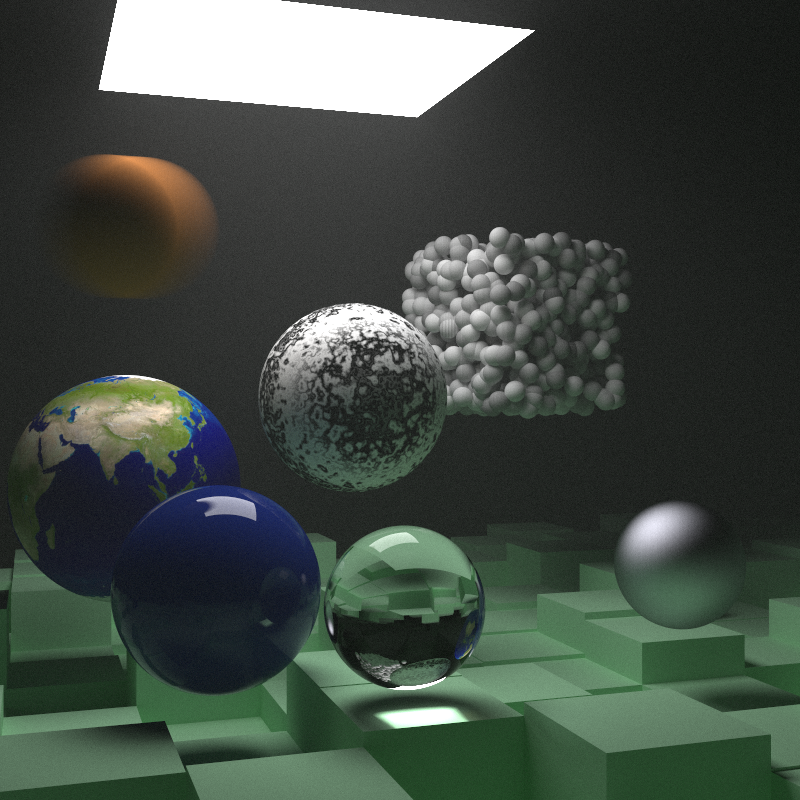

# Ray Tracing in C++

> C++ implementation of an image ray tracer introduced in
> the [Ray Tracing](https://raytracing.github.io/) -book series.

#### Motivation

In order to learn about the essential math and things related to ray tracing, I
decided to follow the great [Ray Tracing](https://raytracing.github.io/) -book
series and implement my own version of the ray tracer. I followed the general
logic and structure of the books, but took some liberty in certain areas. I have
an interest in transforming the code into CUDA some day for acceleration
purposes. Thus, I have made some critical architectural design changes, such as
avoiding virtual functions altogether.

## Features & Architectural Differences

- **Graphical User Interface**
    - Allows easy adjustment of the renderer's settings and show a live preview
      of the rendering process.
    - Using [ImGui](https://github.com/ocornut/imgui) as the GUI library
      and [OpenGL](https://www.opengl.org/) as the backend.

- **Multi-Threaded C++ Renderer**
    - Accelerated rendering using multiple CPU cores via
      a [thread pool](https://github.com/bshoshany/thread-pool).

- **No runtime polymorphism (i.e. virtual functions)**
    - Runtime polymorphism is largely present in the book, and understandably
      so. It does make the code simpler to understand and easier to implement.
      But it comes with cost of virtual function overhead at runtime.
    - Instead, I've opted to use [*Curiously Recurring Template
      Pattern*](https://en.wikipedia.org/wiki/Curiously_recurring_template_pattern)
      (CRTP) for compile-time polymorphism (CTP).

